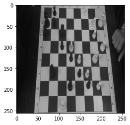

# chess_board_detection
### Task Description
Train deep learning model to detect chessboard in the photo



### Solution
I used mobilenet_v3_small for feature extraction and added fully connected layer with MSELoss for calculating coordinates.
The code is written in Pytorch and Pytorch Lightning.

### Training
To execute training script type:
```bash
python train.py -p ./idchess_zadanie -e 10 -b 32 -g 1
```
Where: 
```bash
usage: train.py [-h] [-p PATH] [-e EPOCHS] [-b BATCH_SIZE] [-g GPU_NUM]

Parser for model training parameters

optional arguments:
  -h, --help            show this help message and exit
  -p PATH, --path PATH  Path to folder with dataset
  -e EPOCHS, --epochs EPOCHS
                        Maximum training epochs
  -b BATCH_SIZE, --batch_size BATCH_SIZE
                        One training batch size
  -g GPU_NUM, --gpu_num GPU_NUM
                        How many GPUs can be used for training
```

After training checkpoint for model is saved in the root directory with the name *simple_mbnet.ckpt*

*ytest.npy* - polygon prediction for xtest.npy

See *chess_detection.ipynb* for detailed example